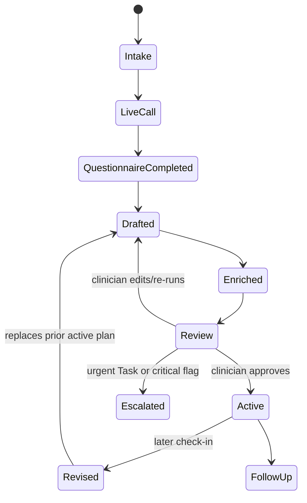

# Care-plan lifecycle

## Overview

CareLoop turns a structured pre-visit conversation into a clinician-reviewable, coded FHIR CarePlan. The plan is not active when generated. It becomes active only after review and approval.

## 1. Intake and context

The clinician selects a condition module and creates the patient. The bridge loads identity, anchor condition, current active medications, allergies/triggers when available, coverage, historical instrument scores, and recent chart context from Medplum. The call begins with identity verification and a history-aware greeting.

## 2. Structured assessment

The module defines the instrument and scoring bands. Asthma uses the five-item ACT (5–25); Depression uses PHQ-9 (0–27, including the self-harm crisis override). The agent asks one item at a time and charts each answer. Supplemental future-risk questions are recorded but not included in the instrument total.

## 3. Deterministic plan selection

`scoreInstrument` computes the total and band. `stepForBand` selects the module's protocol step. A step contains:

- a summary and patient-facing goal;
- zero or more structured `MedOrder`s (RxNorm code, role, sig, route, frequency, PRN, duration, quantity, refills);
- follow-up interval;
- specialist referral/escalation flags.

The LLM does not choose the medication band. This keeps the core action reproducible and inspectable.

## 4. Safety and risk checks

`checkRegimenSafety` compares the drafted regimen with recorded allergies and active medications. Allergy matches are `critical`; duplicate/interaction findings are warnings; informational findings are retained. Risk rules derive future-risk findings from supplemental answers. A critical risk finding can force an urgent Task even when the score band alone would not escalate.

## 5. Draft FHIR resources

The Bot writes finalized score Observations, draft/proposal MedicationRequests, and a draft CarePlan. The CarePlan references every medication activity and includes a scheduled follow-up ServiceRequest activity. If an active CarePlan already exists for the same condition, the new plan uses `CarePlan.replaces` so the revision chain is explicit.

The Bot also writes review Communications containing research, peer review, coverage, and a patient-facing recap. An urgent step creates an urgent `Task` for the care team.

## 6. Deep research, peer review, and coverage enrichment

These workers enrich the draft after deterministic assembly. Research explains the score/band and concerns with citations. Expert personas critique the draft and produce consensus/flags. Stedi adds eligibility/cost context. None of these changes the CarePlan status or activates medication.

## 7. Clinician review and approval

The dashboard Review queue lists draft CarePlans. The clinician sees score trend, chart timeline, regimen, follow-up, safety flags, risk factors, evidence, peer review, coverage, and the patient recap. The regimen can be edited with RxNorm selection before approval.

Approval is a transaction-like workflow: CarePlan `draft` → `active`, each related MedicationRequest `draft` → `active`, and review Task `requested` → `completed`. A critical safety flag requires explicit acknowledgement. The application should record the approving user and timestamp for a production audit trail.

## 8. Follow-up and revision

The follow-up activity records the planned review time. A later check-in produces a new score and draft; the new plan references the previous active plan through `replaces`. Historical score Observations power the trend view and allow the clinician to see whether control is improving, stable, or worsening.

## What is not automatic

CareLoop does not autonomously send a prescription, guarantee insurance payment, diagnose an unstructured concern, or replace emergency care. The patient recap explicitly directs urgent care for sudden deterioration; condition modules also define asthma emergency and depression 988 rules.

