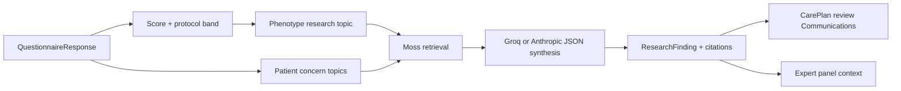

# Deep research and expert peer review

## What “deep research” means here

Deep research is an off-call evidence-synthesis step attached to a draft CarePlan. It does not independently diagnose, prescribe, or activate treatment. It answers two questions for the clinician:

1. What evidence-based rationale fits this patient's condition, instrument score/band, known medications/allergies/triggers, and recorded concerns?
2. What should the clinician consider about each additional concern and escalation threshold?

It is “deep” because the worker researches more than the questionnaire score: it includes the phenotype/severity topic plus one topic for every patient-raised concern, grounds those topics in the condition's Moss corpus, asks an LLM for a short cited synthesis, and stores the findings with the draft.

## Research pipeline

`researchPlan` creates the phenotype topic from the module template (condition, triggers, band, total) and appends concern text. Topics run independently in parallel. Moss retrieval is best-effort and returns up to four snippets. The LLM receives only the patient context needed for the rationale, the score/band, current medications, allergies, triggers, and retrieved clinic snippets.

The requested model output is one JSON object containing a concise rationale and two or three citations. Invalid, empty, unavailable, or failed responses fall back to deterministic text. Each result is a `ResearchFinding` with `topic`, `rationale`, and `citations`.

## Evidence and patient-specific data

Moss supplies clinic knowledge; Medplum supplies patient facts. The LLM is instructed not to invent facts and to treat the result as decision support. Citations are attached as human-readable Communications and rendered in the dashboard. The current fallback citations are generic public clinical references, so a production evidence program should replace them with reviewed, versioned guideline sources and citation verification.

## Expert peer review

The condition module defines expert personas (for example the relevant specialty, pharmacist, and safety reviewer). Each persona receives the draft score/band, regimen, follow-up, escalation state, research rationales, and its own system prompt. Persona calls run in parallel through the configured Groq or Anthropic provider.

Each reviewer returns:

- `agree`, `concern`, or `suggest-edit`;
- rationale;
- optional suggested edit.

Aggregation is deterministic:

- any safety persona with `concern` → `revise`;
- all reviewers agree → `approve-as-drafted`;
- otherwise → `approve-with-notes`.

Every non-agree result is surfaced in the dashboard. This is a panel of model personas, not a licensed clinical sign-off. The human clinician remains the sole approver.

## Failure behavior

Research and peer review are optional dependencies. A failed Moss query, model timeout, malformed JSON, or provider outage should not prevent the deterministic draft from being created. The failure is logged and the dashboard should show missing/incomplete enrichment rather than implying that it ran.

